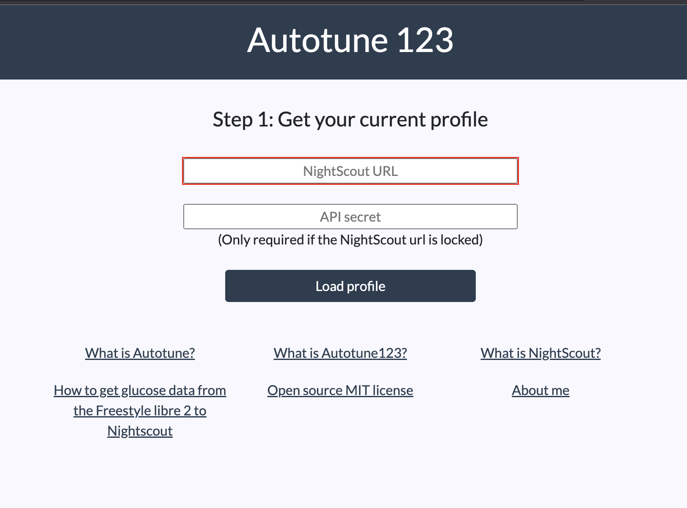
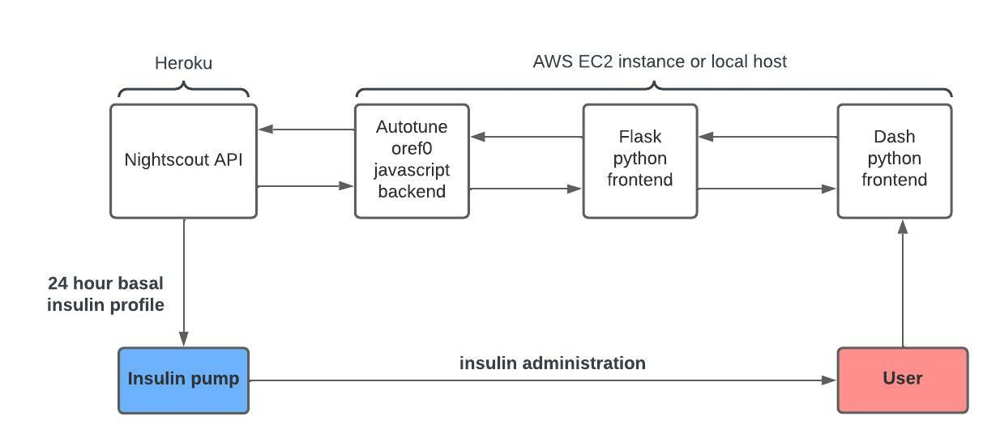

# Autotune123

Autotune123 is a web application for type 1 diabetics to configure their insuline pump basal rate. It relies on the open source [OpenAPS Autotune algorithm](https://github.com/openaps/oref0), the 
Savitzky-Golay filter, and uses data from a personal [NightScout](https://nightscout.github.io/) websites as input to propose a 24-hour basal curve. 
You can see it in action by going to www.autotune123.com and using a NightScout website url as an input.

"Autotune is a work in progress tool. Do not blindly make changes to your pump settings without careful consideration. You may want to print the output of this tool and discuss any particular changes with your care team. Make note that you probably do not want to make long-term changes based on short term (i.e. 24 hour) data. Most people will choose to make long term changes after reviewing carefully autotune output of 3-4 weeks worth of data."
excerpt from [Open APS - Understanding Autotune page](https://openaps.readthedocs.io/en/latest/docs/Customize-Iterate/understanding-autotune.html)

Remember that Autotune only works if:
- You have a NightScout account
- You have logged your carbs accurately
- You virtually disconnect your pump and correctly register insulin administration in the looping app if your pump is physically disconnected (e.g. during showering or blockage of infusion set)

## Screenshot
Loading your profile:

Before and after applying Saivtzky-Golay filter:


## Quality check
You can find a quality check based on the results of Autotuneweb in [this Google Docs link](https://docs.google.com/document/d/1vD75UNISKR1PRoFJYfQb95CWanS69iEYLepJXohpVvs/edit?usp=sharing).
Checks have been performed on: 1) different time periods, 2) with vs. without UAM, 3) Insulin type rapid-acting vs. ulta-rapid acting

## What's up with all the autos?
| | [Autotune](https://openaps.readthedocs.io/en/latest/docs/Customize-Iterate/autotune.html)     | [Autotuneweb](https://autotuneweb.azurewebsites.net/) |[NightScoutsuggestions](https://nightscoutsuggestions.com/) | [Autotune123](http://autotune123.com/)|
|---| --- | --- |--- | --- |
|Year of creation|2016|2018|2021|2022|
|Computer terminal|+|-|-|-|
|Visualisation of recommendations|-|-|+|+|
|Download log files |+|+|-|+|
|Download recommendations|+|+|-|+|
|E-mail recommendations|-|+|-|-|
|See old results|+|+|-|-|
|Use different time zones|+|-|+|-|
|Get profiles in json file|+|+|-|-|
|Adjust min. 5 minutes carb impact|+|+|-|-|
|Direct activation of recommendations on pump|-|-|-|+|
|Change individual basal values in real-time|-|-|-|+|
|Apply smoothing filters|-|-|-|+|
|Switch between fast-acting and fiasp|?|+|-|+|
|UAM option|+|+|-|+|
|Clean calculations based on fasting periods|-|-|+|-|

*UAM = a function that allows the moments in which a glucose increase that is not registered as a meal input by the user to be 
defined by the loop as a unregistered meal, consequently letting the loop administer small boluses of insulin. 

## Flow diagram
This is rouphly how the application works:


## Usage
You can use Autotune123 by going to www.autotune123.com and filling in your NightScout url and your API secret. They are not stored. 
If you don't want to use the website, you can install it on your computer by following the installation steps below.

## Installation
OpenAPS Autotune is based mainly on Javascript. This repository is written in Python. 

If you run it on your own computer, you have to follow the steps written over [here](https://openaps.readthedocs.io/en/latest/docs/Customize-Iterate/autotune.html) to install the Javascript OpenAPS Autotune.

After that install python, pip and git. There is an abundance of good tutorials on YouTube that guide you through the process. 

After installation of these applications run the following commands in your project directory:

```bash
git clone https://github.com/KelvinKramp/Autotune123
```

```bash
pip install -r requirements
```
and run the app:
```bash
python dash_app.py
```
You can easily adjust the code so you don't have to fill in your NightScout url and API secret everytime you run it on your computer  

## Contributing
Feature requests, suggestions and pull requests are very much appreciated and welcome!
(btw I really need someone help me with the frontend, it doesnt look very fancy right now...)


## License
[MIT](https://choosealicense.com/licenses/mit/)
